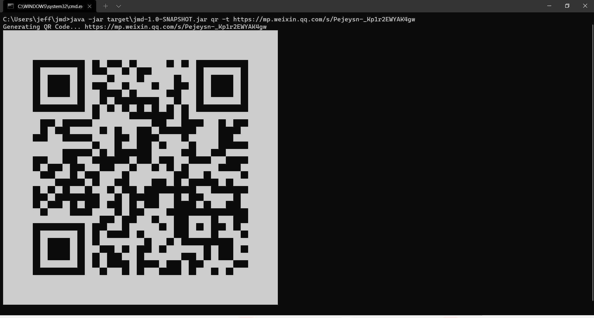

# jmd

---

> Demo command line app written in Java, that displays QR code in terminal

## Example Usage

```shell
git clone https://github.com/Jeff-Tian/jmd
cd jmd
mvn install
java -jar target\jmd-1.0-SNAPSHOT.jar qr -t https://mp.weixin.qq.com/s/Pejeysn-_Kp1r2EWYAK4gw
```

The output is as follows:


## How was it created?

```shell
mvn archetype:generate -DgroupId=com.uniheart.app -DartifactId=jmd -DarchetypeArtifactId=maven-archetype-quickstart -DinteractiveMode=false
```

Notice, the above command line doesn't work in Windows Powershell but works in CMD.

Powershell error output:

```powershell
PS C:\Users\jeff\jmd> mvn archetype:generate -DgroupId=com.uniheart.app -DartifactId=jmd -DarchetypeArtifactId=maven-archetype-quickstart -DinteractiveMode=false
[INFO] Scanning for projects...
[INFO] ------------------------------------------------------------------------
[INFO] BUILD FAILURE
[INFO] ------------------------------------------------------------------------
[INFO] Total time:  0.110 s
[INFO] Finished at: 2022-04-01T10:30:55+08:00
[INFO] ------------------------------------------------------------------------
[ERROR] The goal you specified requires a project to execute but there is no POM in this directory (C:\Users\jeff\jmd). Please verify you invoked Maven from the correct directory. -> [Help 1]
[ERROR]
[ERROR] To see the full stack trace of the errors, re-run Maven with the -e switch.
[ERROR] Re-run Maven using the -X switch to enable full debug logging.
[ERROR]
[ERROR] For more information about the errors and possible solutions, please read the following articles:
[ERROR] [Help 1] http://cwiki.apache.org/confluence/display/MAVEN/MissingProjectException
```

## Clean the target folder

```shell
mvn clean
```

## Compile

```shell
mvn compile
```

## Test

```shell
mvn test
```

## Build the project source code file and create executable binary
```shell
mvn install
```
Creates platform independent binary executable .jar or .war file in the target/ folder

## Run from local

```shell
java src\main\java\com\uniheart\app\App.java
```

or `mvn install` first, then

```shell
java -jar target\jmd-1.0-SNAPSHOT.jar
```
or

```shell
# Hello World
java -classpath C:\Users\jeff\jmd\target\classes;C:\Users\jeff\.m2\repository\info\picocli\picocli\3.9.6\picocli-3.9.6.jar com.uniheart.app.App

# qr
java -classpath C:\Users\jeff\jmd\target\classes;C:\Users\jeff\.m2\repository\info\picocli\picocli\3.9.6\picocli-3.9.6.jar;C:\Users\jeff\.m2\repository\com\google\zxing\core\3.3.0\core-3.3.0.jar;C:\Users\jeff\.m2\repository\com\google\zxing\javase\3.3.0\javase-3.3.0.jar;C:\Users\jeff\.m2\repository\com\beust\jcommander\1.48\jcommander-1.48.jar;C:\Users\jeff\.m2\repository\com\github\jai-imageio\jai-imageio-core\1.3.1\jai-imageio-core-1.3.1.jar com.uniheart.app.App qr -t https://mp.weixin.qq.com/s/Pejeysn-_Kp1r2EWYAK4gw
```

or
```shell
java -jar target\jmd-1.0-SNAPSHOT.jar
```

## Troubleshooting on Windows 10

### mvn compile failed by ` Compilation failure

[ERROR] No compiler is provided in this environment. Perhaps you are running on a JRE rather than a JDK?`

1. Install jabba
2. Install openjdk@17.0.2
    ```shell
    jabba install openjdk@1.17.0
    jabba use openjdk@1.17.0
    ```
3. Check mvn runtime by
   ```shell
   mvn --version
   # notice the runtime output 
   # If it's not the same as openjdk@17.0.2 just installed, then change it by setting JAVA_HOME environment variables 
   ```
4. Find the java home
    ```shell
    where java
    C:\Users\jeff\scoop\apps\openjdk\current\bin\java.exe
    ```
5. Setting the JAVA_HOME and then rerun
    ```shell
    set JAVA_HOME=C:\Users\jeff\scoop\apps\openjdk\current
    mvn compile
    ```

### mvn compile complaints `[ERROR] 不再支持源选项 5。请使用 7 或更高版本。`

在 pom.xml 增加如下配置：

```xml
<properties>
    <project.build.sourceEncoding>UTF-8</project.build.sourceEncoding>
    <maven.compiler.encoding>UTF-8</maven.compiler.encoding>
    <java.version>17</java.version>
    <maven.compiler.source>17</maven.compiler.source>
    <maven.compiler.target>17</maven.compiler.target>
</properties>
```